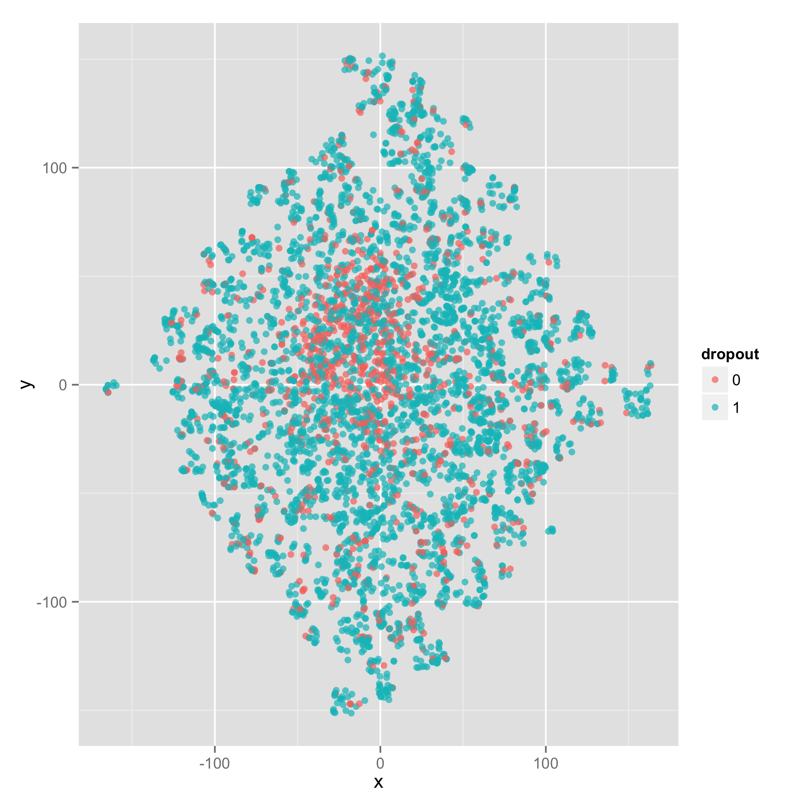

# KDDCUP 2015 まとめ
* [公式サイト](https://kddcup2015.com/information.html)

* 参加チーム : 最終的に821チーム

* 半分のテストデータのランキング : 最終的に 71位 , AUC = 0.88926くらい

## プロセス
* 特徴作り -> モデル作り -> (アンサンブル)

* 生のデータからの 特徴作りは C++ を用いて行い, それ以外は R で行った.

## 問題

* 中国の [MOOC](https://ja.wikipedia.org/wiki/Massive_open_online_course) (XuetangX) のアクセスログを用いて
  利用者がDropoutするかどうかを予想する.

* Dropoutの定義 : アクセスログの集計期間の終了日から10日間以内にアクセスログを残していない場合.

* 基本的にアクセスログから特徴量を作る. (訓練:約12万, テスト:約8万インスタンス, テストのラベルは与えられない)

train データのアクセスログ (testもこの形式)
```
enrollment_id,time,source,event,object
1,2014-06-14T09:38:29,server,navigate,Oj6eQgzrdqBMlaCtaq1IkY6zruSrb71b <- ここから
1,2014-06-14T09:38:39,server,access,3T6XwoiMKgol57cm29Rjy8FXVFcIomxl
1,2014-06-14T09:38:39,server,access,qxvBNYTfiRkNcCvM0hcGwG6hvHdQwnd4
1,2014-06-14T09:38:48,server,access,2cmZrZW2h6Il91itO3e89FGcABLWhf3W
1,2014-06-14T09:41:49,browser,problem,RMtgC2bTAqEeftenUUyia504wsyzeZWf
1,2014-06-14T09:41:50,browser,problem,RMtgC2bTAqEeftenUUyia504wsyzeZWf
.....
1,2014-07-11T09:32:28,browser,problem,zt9gsIMTOqzqxuFRa1dDT58JBFRdLX3O
1,2014-07-11T09:32:28,browser,problem,zt9gsIMTOqzqxuFRa1dDT58JBFRdLX3O
1,2014-07-11T09:52:56,server,navigate,vPJ7ada7OqDfvYXMjnTQC3NExmLvWiUL
1,2014-07-11T09:52:58,browser,page_close,3T6XwoiMKgol57cm29Rjy8FXVFcIomxl <- ここまで1つのインスタンス
3,2014-06-19T08:43:27,server,navigate,9Mur5ciTV9IBFfcPaz5c3nC1lrZaxBvG
3,2014-06-19T08:43:41,server,navigate,9Mur5ciTV9IBFfcPaz5c3nC1lrZaxBvG
3,2014-06-19T08:43:42,server,navigate,9Mur5ciTV9IBFfcPaz5c3nC1lrZaxBvG
.....
```

## 感想
特徴作りが重要なコンペティションだったと思う. (コンペティションに参加したのは初めて)
学習でstackingなどのモデルのアンサンブルなどを試したが, gradient boost 単体よりも良くならない.

#### 使えると思ったRのパッケージ
1. [xgboost](https://github.com/dmlc/xgboost) - gradient boost. (gbmよりかなり速い, CRANにはない)
2. [randomForest](http://cran.r-project.org/web/packages/randomForest/randomForest.pdf) - 並列計算できない.
3. [extraTrees](http://cran.r-project.org/web/packages/extraTrees/extraTrees.pdf) - Extremely Randomized Trees.
4. [FNN](http://cran.r-project.org/web/packages/FNN/FNN.pdf) - k-NN.
5. [Rtsne](http://cran.r-project.org/web/packages/Rtsne/Rtsne.pdf) - t-SNE.
6. [LiblineaR](http://cran.r-project.org/web/packages/LiblineaR/LiblineaR.pdf) - liblinear
7. [kernlab](http://cran.r-project.org/web/packages/kernlab/kernlab.pdf) - kernel SVM など.
8. [rgl](http://cran.r-project.org/web/packages/rgl/rgl.pdf) - 3次元プロットができる. OpenGLベース. htmlで保存できて, R環境がなくてもマウスでグリグリできる. [e.g.](https://www.dropbox.com/s/skoo1iazx4ohqph/index.html?raw=1)
9. [GGally](http://cran.r-project.org/web/packages/GGally/GGally.pdf) - 特徴同士を格子状に配列し, 関係を把握するpair plot(下の図).


#### 参考にしたwebページ

* [実践多クラス分類 Kaggle Ottoから学んだこと](http://www.slideshare.net/nishio/kaggle-otto)

* [KAGGLE ENSEMBLING GUIDE](http://mlwave.com/kaggle-ensembling-guide/)

* [KDD Cup 2013 1位paper](http://www.kdd.org/kddcup2013/sites/default/files/papers/track1place1.pdf)

## 特徴量
|   番号  |                                     内容                                     |
| :------ | ---------------------------------------------------------------------------- |
| 1       | 3分間のイベントを1回としてカウント                                           |
| 2       | max(0, log( 特徴1))                                                          |
| 3       | 30分間のイベントを1回としてカウント                                          |
| 4       | max(0, log( 特徴3))                                                          |
| 5       | 3時間のイベントを1回としてカウント                                           |
| 6       | max(0, log( 特徴5))                                                          |
| 7       | 1日のイベントを1回としてカウント                                             |
| 8       | max(0, log( 特徴7))                                                          |
| 9       | 0 - 3 時のイベント回数                                                       |
| 10      | max(0, log( 特徴9))                                                          |
| 11      | 3 - 6 時のイベント回数                                                       |
| 12      | max(0, log(特徴11))                                                          |
| 13      | 6 - 9 時のイベント回数                                                       |
| 14      | max(0, log(特徴13))                                                          |
| 15      | 9 - 12時のイベント回数                                                       |
| 16      | max(0, log(特徴15))                                                          |
| 17      | 12 - 15時のイベント回数                                                      |
| 18      | max(0, log(特徴17))                                                          |
| 19      | 15 - 18時　のイベント回数                                                    |
| 20      | max(0, log(特徴19))                                                          |
| 21      | 18 - 21時のイベント回数                                                      |
| 22      | max(0, log(特徴21))                                                          |
| 23      | 21 - 24 時のイベント回数                                                     |
| 24      | max(0, log(特徴23))                                                          |
| 25      | 1日のイベントを1回としてカウントしたときのイベントの間隔の平均（日単位）     |
| 26      | 1日のイベントを1回としてカウントしたときのイベントの間隔の分散 (日単位)      |
| 27      | 1日のイベントを1回としてカウントしたときのイベントの間隔の中央値 (日単位)    |
| 28      | 最長の1日のイベントを1回としてカウントしたときのイベントの間隔 (日単位)      |
| 29      | video eventの間隔 (時間単位)                                                 |
| 30      | video eventの分散 (時間単位)                                                 |
| 31      | video eventの中央値 (時間単位)                                               |
| 32      | 最長のvideo eventの間隔 (時間単位)                                           |
| 33      | problem の回数                                                               |
| 34      | max(0, 特徴33))                                                              |
| 35      | video の回数                                                                 |
| 36      | max(0, 特徴35))                                                              |
| 37      | access の回数                                                                |
| 38      | max(0, 特徴37))                                                              |
| 39      | wiki の回数                                                                  |
| 40      | max(0, 特徴39))                                                              |
| 41      | discussion の回数                                                            |
| 42      | max(0, 特徴41))                                                              |
| 43      | navigate の回数                                                              |
| 44      | max(0, 特徴43))                                                              |
| 45      | page_close の回数                                                            |
| 46      | max(0, 特徴45))                                                              |
| 47      | 各種イベントの合計                                                           |
| 48      | max(0, log(特徴47))                                                          |
| 49      | server ソースのイベント                                                      |
| 50      | max(0, log(特徴49))                                                          |
| 51      | browser ソースのイベント                                                     |
| 52      | max(0, log(特徴51))                                                          |
| 53      | 最後のイベントと2014-08-01T00:00:00の間の日数                                |
| 54      | trainとtest合わせて，そのenrollment idのユーザーが何個コースを履修しているか |
| 55      | ログの最初と最後の日付の差                                                   |
| 56-94   | どのコース(全39)を受講しているか (特徴56~94)                                 |
| 95      | そのidが履修しているコースの開始日とid が初めてイベントを起こした日の差      |
| 96      | そのidが履修しているコースの終了日とid が最後にイベントを起こした日の差      |
| 97      | (特徴95) - (特徴96)                                                          |
| 98      | (特徴96) - (特徴95)                                                          |
| 99      | (特徴95) * (特徴96)                                                          |
| 100     | abs(特徴97) * (31 - ログの最初と最後の日付の差(特徴55))                      |
| 101     | total sum                                                                    |
| 102     | total sum 1                                                                  |
| 103     | total sum 2                                                                  |
| 104     | total last10 sum                                                             |
| 105     | total last10 sum 1                                                           |
| 106     | total last10 sum 2                                                           |
| 107     | total non zero day                                                           |
| 108     | problem sum                                                                  |
| 109     | problem sum 1                                                                |
| 110     | problem sum 2                                                                |
| 111     | problem last10 sum                                                           |
| 112     | problem last10 sum 1                                                         |
| 113     | problem last10 sum 2                                                         |
| 114     | problem non zero day                                                         |
| 115     | video sum                                                                    |
| 116     | video sum 1                                                                  |
| 117     | video sum 2                                                                  |
| 118     | video last10 sum                                                             |
| 119     | video last10 sum 1                                                           |
| 120     | video last10 sum 2                                                           |
| 121     | video non zero day                                                           |
| 122     | access sum                                                                   |
| 123     | access sum 1                                                                 |
| 124     | access sum 2                                                                 |
| 125     | access last10 sum                                                            |
| 126     | access last10 sum 1                                                          |
| 127     | access last10 sum 2                                                          |
| 128     | access non zero day                                                          |
| 129     | wiki sum                                                                     |
| 130     | wiki sum 1                                                                   |
| 131     | wiki sum 2                                                                   |
| 132     | wiki last10 sum                                                              |
| 133     | wiki last10 sum 1                                                            |
| 134     | wiki last10 sum 2                                                            |
| 135     | wiki non zero day                                                            |
| 136     | discu sum                                                                    |
| 137     | discu sum 1                                                                  |
| 138     | discu sum 2                                                                  |
| 139     | discu last10 sum                                                             |
| 140     | discu last10 sum 1                                                           |
| 141     | discu last10 sum 2                                                           |
| 142     | discu non zero day                                                           |
| 143     | naviga sum                                                                   |
| 144     | naviga sum 1                                                                 |
| 145     | naviga sum 2                                                                 |
| 146     | naviga last10 sum                                                            |
| 147     | naviga last10 sum 1                                                          |
| 148     | naviga last10 sum 2                                                          |
| 149     | naviga non zero day                                                          |
| 150     | page close sum                                                               |
| 151     | page close sum 1                                                             |
| 152     | page close sum 2                                                             |
| 153     | page close last10 sum                                                        |
| 154     | page close last10 sum 1                                                      |
| 155     | page close last10 sum 2                                                      |
| 156     | page close non zero day                                                      |
| 157-184 | moving average of total event (30days, interval = 3, shift = 1)              |
| 185-212 | moving average of problem event (30days, interval = 3, shift = 1)            |
| 213-240 | moving average of video event (30days, interval = 3, shift = 1)              |
| 241-268 | moving average of access event (30days, interval = 3, shift = 1)             |
| 269-296 | moving average of wiki event (30days, interval = 3, shift = 1)               |
| 297-324 | moving average of discussion event (30days, interval = 3, shift = 1)         |
| 325-352 | moving average of navigate event (30days, interval = 3, shift = 1)           |
| 353-380 | moving average of page_close event (30days, interval = 3, shift = 1)         |
| 381     | complete                                                                     |
| 382     | complete_rate                                                                |
| 383     | depth1 of accress object                                                     |
| 384     | depth2 of accress object                                                     |
| 385     | depth3 of accress object                                                     |
| 386     | depth5 of accress object                                                     |
| 387     | depth. of accress object                                                     |
| 388-442 | primal interaction  of 特徴{4,27,28, 54,95,96,103,106,107,383}               |
|         |                                                                              |

#### 特徴選択を行う必要があるか ?
* 特徴207~290を消すとxgboostではAUCが若干(0.0002)あがる.

* Random Forest の 特徴量の重要度(ジニ係数の平均減少) を見て特徴を減らしたが, AUCが上がらない.

#### 次元削減 t-Distributed Stochastic Neighbor Embedding
* Kaggle の Otto Group Product Classification Challenge　では上位チームがt-SNEを特徴量として追加している
    * [1st PLACE - WINNER SOLUTION - Gilberto Titericz & Stanislav Semenov](https://www.kaggle.com/c/otto-group-product-classification-challenge/forums/t/14335/1st-place-winner-solution-gilberto-titericz-stanislav-semenov)
* t-SNE (2次元, 3次元) の結果を特徴量に入れてみてもAUCは上がらなかった.

* t-SNE 結果 (train,test合わせてt-SNE)
    * 2次元(1000サンプルプロット) 
    * [3次元の結果(1000サンプルプロット)](figure/tsne3_3/index.html)


#### 1次の交互作用 (特徴{4,27,28, 54,95,96,103,106,107,383} のみ)
* 効果なし


## 学習器
(検証用データを訓練データ全体の一部からとってAUCを計算, パラメータはCVで調整)

* ガウシアンカーネル SVM (0.83), 多項式カーネルSVM (0.68)

* l2-regularized {logistic, l2-hinge, l1-hinge} (0.85)

* random forest (0.87)

* extremely randomized trees (0.873)

* gradient boost model (0.885)

#### 外れ値
* 20-近傍法 の学習結果で間違え度が大きいものから順に選ぶ. 全サンプルの1%や3%減らしてみたが
AUCが上がることはなかった.


## モデルをアンサンブル
* Stacking
訓練データをほぼ同じ大きさの6-foldsに分けて, 5-foldsを訓練に 1-foldを検証に用いる.
上の学習器を各fold, 1つを訓練データに使って 学習 (１つの学習器で5つのモデル)
その出力を特徴量として, もう一度学習器にかける. ->ベストでAUC=0.883くらい

全サンプルで学習したgradient boostのみに勝てない.


* gradient boost model で全訓練データを使って  パラメータ変えたり, 特徴を変えたりして10個くらい作ったモデル
の結果の平均値をとったもの : (提出AUC = 0.8892)

```
param <- list("objective"="binary:logistic", "eval_metric"="auc", "max_depth"=3, "nthred"=8, "bst:eta" =0.1, "bst:gamma"=0.1)

bst.cv <- xgb.cv(param=param, data=xgmat, nfold=10, nrounds=500)
bst <- xgboost(param=param, data=xgmat, nrounds=778)
```

## memo

* Kaggle
    * [10 R Packages to Win Kaggle Competitions](http://www.slideshare.net/DataRobot/final-10-r-xc-36610234)
    * [実践多クラス分類 Kaggle Ottoから学んだこと](http://www.slideshare.net/nishio/kaggle-otto)
    * [KAGGLE ENSEMBLING GUIDE](http://mlwave.com/kaggle-ensembling-guide/)
    * [How Much Did It Rain? Winner's Interview: 2nd place, No Rain No Gain](http://blog.kaggle.com/2015/06/08/how-much-did-it-rain-winners-interview-2nd-place-no-rain-no-gain/)
    * [Using Ensembles in Kaggle Data Science Competitions- Part 3](http://www.kdnuggets.com/2015/06/ensembles-kaggle-data-science-competition-p3.html)

* KDD Cup
    * [KDD Cup 2009](https://jsai.ixsq.nii.ac.jp/ej/index.php?active_action=repository_view_main_item_detail&page_id=13&block_id=8&item_id=206&item_no=1)
    * [KDD Cup 2013 1位paper](http://www.kdd.org/kddcup2013/sites/default/files/papers/track1place1.pdf)
    * [KDD Cup 2013 5位paper](http://www.kdd.org/kddcup2013/sites/default/files/papers/track1place5.pdf)
    * [スライドメモ:KDD2014 Tutorial "the Recommender Problem Revisited"](http://yagays.github.io/blog/2014/09/08/kdd2014-tutorial-recommendation/)

* Stacking
    * [ランダムフォレストと他の機械学習（or統計）を組み合わせて使う](http://shindannin.hatenadiary.com/entry/2015/03/13/101945#f-5aaaa40e)
    * [Stacking, Blending and Stacked Generalization](http://www.chioka.in/stacking-blending-and-stacked-generalization/)
    * [stackingを試してみた](http://smrmkt.hatenablog.jp/entry/2015/03/15/161209)

* GBDT (xgboost)
    * [パッケージユーザーのための機械学習(12)：Xgboost (eXtreme Gradient Boosting)](http://tjo.hatenablog.com/entry/2015/05/15/190000)
    * [勾配ブースティングについてざっくりと説明する](http://smrmkt.hatenablog.jp/entry/2015/04/28/210039)
    * [最近、流行のxgboost](http://puyokw.hatenablog.com/entry/2015/04/04/025835)
    * [XGBoost Parameters](https://github.com/dmlc/xgboost/blob/master/doc/parameter.md)
    * [XGBoost example](https://github.com/dmlc/xgboost/blob/master/demo/kaggle-higgs/higgs-train.R)
    * [Xgboost のR における具体例 (クラス分類)](http://puyokw.hatenablog.com/entry/2015/04/29/000557)
    * [Gradient Boosting Decision Treeでの特徴選択 in R](http://www.housecat442.com/?p=480)

* randomForest
    * [Package randomForest](http://cran.r-project.org/web/packages/randomForest/randomForest.pdf)
    * [Random Forest Cross-Valdidation for feature selection](http://www.inside-r.org/packages/cran/randomForest/docs/rfcv)

* extra Tree
    * [Package extraTrees](http://cran.r-project.org/web/packages/extraTrees/extraTrees.pdf)

* t-SNE
    * [次元削除 ( t-SNE )](http://puyokw.hatenablog.com/entry/2015/06/21/000102)
    * [Package Rtsne](http://cran.r-project.org/web/packages/Rtsne/Rtsne.pdf)

* kNN
    * [Package FNN](http://cran.r-project.org/web/packages/FNN/FNN.pdf)
    * [kNN関連パッケージの紹介](http://fqz7c3.hatenablog.jp/entry/2014/12/13/183406)

* adaboost.M1
    * [boosting {adabag}](http://www.inside-r.org/packages/cran/adabag/docs/boosting)

* Sofia
    * [Package RSofia](http://cran.r-project.org/web/packages/RSofia/RSofia.pdf)

* Neural Networks
    * [機械学習ライブラリ Chainerの紹介](http://nonbiri-tereka.hatenablog.com/entry/2015/06/14/225706)
    * [Neural Networks João Neto](http://www.di.fc.ul.pt/~jpn/r/neuralnets/neuralnets.html)
    * [Popular Deep Learning Tools - a review](http://www.kdnuggets.com/2015/06/popular-deep-learning-tools.html)

* Markdown
    * [Markdown syntax](http://daringfireball.net/projects/markdown/syntax)
    * [Markdown記法 チートシート](http://qiita.com/Qiita/items/c686397e4a0f4f11683d)

* R plot
    * [ggplot2できれいなグラフ](http://sssslide.com/www.slideshare.net/dichika/ggplot2)
    * [Package rgl](http://cran.r-project.org/web/packages/rgl/rgl.pdf)
    * [三次元散布図をRで描くのに画期的な新機能がRGLパッケージに加わった](http://d.hatena.ne.jp/hoxo_m/20120425/p1)
    * [inside-R writeWebGL {rgl}](http://www.inside-r.org/packages/cran/rgl/docs/writeWebGL)

####  最初のアクセスと最後のアクセスまでの区間の例えば2等分した区間毎に特徴を作る
* データの区間を2分割して, 前半と後半で特徴を並べる. <br>
  -> 学習データ {(X_t-1, X_t), y_t} として,

* AUC　= 0.6ぐらい

#### stacking
s1. 特徴1-4を線形L2正則化ロジスティック回帰(biasあり)でスタッキング (全訓練サンプル使用) <br>
s2. 特徴5-12を線形L2正則化ロジスティック回帰(biasあり)でスタッキング (全訓練サンプル使用) <br>
s3. 特徴19-28を線形L2正則化ロジスティック回帰(biasあり)でスタッキング (全訓練サンプル使用) <br>

現在のベストは 全特徴を使ったxgboost (stacking なし) これは,無い方がいい. 全サンプルというのがいけない.

#### xgboost の 特徴重要度のプロット (古い特徴)


#### 1から29特徴 +　特徴 1-4 stacking + 特徴5-12 stacking + 特徴19-28 stacking を使った結果 AUC= 0.8684362739737007
AUC上がらず. 特徴1-4がすでにGainが高いのに，それをstackingしたらその特徴がかなり支配的になった．

29が特徴1-4 stacking, 30が特徴5-12 stacking, 31が特徴19-28stacking


#### 1から29特徴 +　特徴5-12 stacking + 特徴19-28 stacking を使った結果 AUC= 0.8684362739737007
AUC上がらず. 特徴1-4がすでにGainが高いのに，それをstackingしたらその特徴がかなり支配的になった．

29が特徴5-12 stacking, 30が特徴19-28stacking


#### 1から29特徴 + 特徴5-12 stackingを使った結果 AUC=0.8684294405320121
AUC上がらず.

29が特徴5-12 stacking


#### 1から29特徴を使った結果 (スケーリング無) (提出した結果のAUC = 0.8689924055172544  )

```
> xgb.importance(model=bst)
    Feature         Gain       Cover   Frequence
 1:       1 0.3183888141 0.051689294 0.019521718
 2:       0 0.2969348620 0.070285396 0.033186920
 3:      28 0.0790664954 0.257295208 0.244509517
 4:      26 0.0688916458 0.062221455 0.039531479
 5:       2 0.0675799623 0.043189332 0.019521718
 6:       3 0.0541588811 0.058431991 0.042459736
 7:      13 0.0281940046 0.048812845 0.036115178
 8:      18 0.0252042773 0.075359032 0.082479258
 9:      12 0.0147320488 0.036095040 0.045876037
10:      24 0.0105478285 0.022101974 0.031234749
11:      25 0.0053650200 0.027118535 0.022449976
12:      14 0.0046883997 0.013214345 0.021961933
13:      15 0.0029290785 0.014155941 0.030258663
14:      17 0.0024335983 0.013965149 0.026842362
15:      20 0.0019434010 0.011155529 0.021473890
16:      27 0.0018329980 0.011403673 0.022449976
17:      19 0.0018152319 0.017020018 0.020497804
18:      16 0.0017862779 0.023923951 0.024890190
19:      22 0.0017174588 0.023275812 0.026354319
20:       9 0.0017114500 0.019635341 0.020985847
21:       7 0.0014797804 0.002585733 0.023426061
22:      23 0.0014606294 0.010765653 0.020985847
23:       5 0.0013145434 0.022725685 0.026842362
24:       4 0.0012318087 0.006928827 0.019521718
25:       8 0.0012090551 0.011730912 0.022449976
26:      21 0.0010719181 0.009436864 0.012201074
27:       6 0.0010482689 0.023462442 0.020985847
28:      11 0.0006729460 0.001829895 0.011224988
29:      10 0.0005893159 0.010184125 0.009760859
```

#### Random Forest をやった結果
##### 1から29特徴を使った結果 (スケーリング無) (提出した結果のAUC = 0.8587864456972467  )

```
 randomForest(formula = V30 ~ ., data = X, mtry = 2, auto.weight = TRUE)
               Type of random forest: classification
                     Number of trees: 500
No. of variables tried at each split: 2

        OOB estimate of  error rate: 13.26%
Confusion matrix:
      0     1 class.error
0 13321 11640  0.46632747
1  4349 91232  0.04550067
    MeanDecreaseGini
V1        1997.15820
V2        1923.29218
V3        1841.70954
V4        1440.48918
V5         590.70274
V6         715.81019
V7         753.31845
V8         730.88510
V9         897.60313
V10        566.84602
V11         96.63781
V12        176.11418
V13       1137.85678
V14       1447.62003
V15       1010.16523
V16       1037.20360
V17       1019.11977
V18       1076.27138
V19       1424.48715
V20       1034.61033
V21       1707.06517
V22        392.04333
V23        643.51301
V24       1314.96708
V25       1475.82474
V26       1781.78669
V27       1733.33947
V28       1517.73469
V29       1422.12041
```

#### 1から29特徴 + stacking (提出AUC = 0.8580468085918825)
```
        OOB estimate of  error rate: 13.3%
Confusion matrix:
      0     1 class.error
0 13233 11728  0.46985297
1  4302 91279  0.04500895
> print(importance(forest));
    MeanDecreaseGini
V1        1847.24105
V2        1693.03063
V3        1279.14553
V4        1241.66594
V5         515.00254
V6         637.77564
V7         606.24468
V8         685.33313
V9         770.12915
V10        463.52528
V11         86.33381
V12        157.64083
V13       1112.80861
V14        953.79325
V15        815.97191
V16        883.78643
V17        904.59216
V18        829.34497
V19       1086.30223
V20        855.34499
V21       1213.78159
V22        347.60223
V23        622.40477
V24       1085.38455
V25       1298.55251
V26       1368.13715
V27       1649.37598
V28       1440.55355
V29       1291.38716
s1        2214.08498
s2        1680.58631
s3        1814.39112
```

#### 1-29特徴でlogistic reggression (スケーリング無)
提出 AUC = 0.7903455189840172

## Tips

#### logout後もRを回し続ける
* まっさらな状態からスタート
`nohup R --vanilla --slave <source.R`

* 以前保存した状態を読み込んでスタート
`nohup R --save --slave <source.R`

##ソース説明

#### make_train_test_data.cp
 log_train.csv と true_trian.csv から 訓練用のデータを, log_test.csv, enrollment_test.csv から テストデータを作る

#### How to compile
* Eigen と std=c++11 オプションが使える必要がある.
* Eigen が パッケージ管理ソフト等でインストールしてある場合 (例えば Ubuntuの場合)
    * `> g++ -std=c++11 -I/usr/include/eigen3 make_train_data.cpp -o make_train_data`

* Eigen を落としてきて解答してできたディレクトリ内のEigenが make_train_data.cpp を同一ディレクトリ内にある場合
    * `>g++ -std=c++11 -I./ make_train_data.cpp -o make_train_data`

#### How to use
* `> ./make_train_test_data log_train.csv true_train.csv log_test.csv enrollment_test.csv output_train_file_name output_test_file_name`
    * output_train_file_name に 訓練用のデータが出力される
    * output_test_file_name に テストデータを出力する
    * 実行すると, 消したい特徴量を聞かれる. ない場合は enter
    * 次に scaling するか聞かれる. 1はなし, 2はlibsvm のsvm-scale と同じ(正規化ではない)

## timepoint.hpp
* 文字列で表される時間　例えば,"2014-05-28T02:30:10"から std::chrono::system_clock::time_pointを作る
* make_train_data.cpp 内で使用

